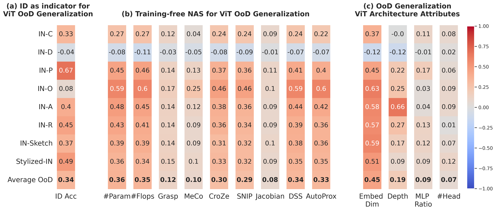

# [NeurIPS 2024] OoD-ViT-NAS: Vision Transformer Neural Architecture Search for Out-of-Distribution Generalization: Benchmark and Insights
This is **the official code** of our paper, which has been accepted by the main conference of **NeurIPS 2024** 🔥🔥: 

**[Vision Transformer Neural Architecture Search for Out-of-Distribution Generalization: Benchmark and Insights](https://openreview.net/forum?id=2AIwiIkE0s)** <br>
Sy-Tuyen Ho*, Tuan Van Vo*, Somayeh Ebrahimkhani*, Ngai-Man Cheung <br>
(*) **Equal contribution** <br>
**NeurIPS 2024**

### Abstract: 
While Vision Transformer (ViT) have achieved success across various machine learning tasks, deploying them in real-world scenarios faces a critical challenge: generalizing under Out-of-Distribution (OoD) shifts. A crucial research gap remains in understanding how to design ViT architectures – both manually and automatically – to excel in OoD generalization. **To address this gap**, we introduce OoD-ViT-NAS, the first systematic benchmark for ViT Neural Architecture Search (NAS) focused on OoD generalization. This comprehensive benchmark includes 3,000 ViT architectures of varying model computational budgets evaluated on 8 common large-scale OoD datasets. With this comprehensive benchmark at hand, we analyze the factors that contribute to the OoD generalization of ViT architecture. Our analysis uncovers several key insights. Firstly, we show that ViT architecture designs have a considerable impact on OoD generalization. Secondly, we observe that In-Distribution (ID) accuracy might not be a very good indicator of OoD accuracy. This underscores the risk that ViT architectures optimized for ID accuracy might not perform well under OoD shifts. Thirdly, we conduct the first study to explore NAS for ViT's OoD robustness. Specifically, we study $9$ Training-free NAS for their OoD generalization performance on our benchmark. We observe that existing Training-free NAS are largely ineffective in predicting OoD accuracy despite their effectiveness at predicting ID accuracy. Moreover, simple proxies like \#Param or \#Flop surprisingly outperform more complex Training-free NAS in predicting ViTs OoD accuracy. Finally, we study how ViT architectural attributes impact OoD generalization. We discover that increasing embedding dimensions of a ViT architecture generally can improve the OoD generalization. We show that ViT architectures in our benchmark exhibit a wide range of OoD accuracy, with up to 11.85% for some OoD shift, prompting the importance to study ViT architecture design for OoD. We firmly believe that our OoD-ViT-NAS benchmark and our analysis can catalyze and streamline important research on understanding how ViT architecture designs influence OoD generalization.

### Illustration:



### Installation
You use conda to create a virtual environment to run this project.

```bash

cd  OoD-ViT-NAS
conda create --name OoDViTNAS python=3.7.16
conda activate OoDViTNAS
pip install -r requirements.txt
```
After this, you should installl pytorch and torchvision package which meet your GPU and CUDA version according to https://pytorch.org
And install nvidia dail according to https://docs.nvidia.com/deeplearning/dali/user-guide/docs/installation.html
	
Quick Start
=====================================

Dataset
--------------
You can download the OoD-ViT-NAS Out-of-Distribution Generalization dataset from: https://drive.google.com/drive/folders/19nb6d2DttDCLhWNY117M8nFn7zxb2LH2?usp=sharing

The dataset is divided into three AutoFormer search spaces: Supernet-Base, Supernet-Small, and Supernet-Tiny. Each dataset includes evaluation results (ID Accuracy, OoD Accuracy) for 8 large common OoD datasets: ImageNet-C, ImageNet-A, ImageNet-O, ImageNet-P, ImageNet-D, ImageNet-R, ImageNet-Sketch, and Stylized ImageNet. This structure helps keep file sizes manageable and allows for selective evaluation results. To use the provided helper class, you need to download the merged JSON data files: OoD-ViT-NAS-Small.json, OoD-ViT-NAS-Tiny.json, and OoD-ViT-NAS-Base.json.

Evaluation of ViT AutoFormer Pipeline on 8 Common OoD Datasets
--------------
If you want to use this project to evaluate ViT architectures from the AutoFormer supernet (https://github.com/microsoft/Cream/tree/main/AutoFormer), you can create a work directory for saving configuration files, JSON results, etc.

We provide an example of evaluating ViT architectures from the AutoFormer supernet-small, supernet-tiny, and supernet-base on 8 common OoD datasets: ImageNet-C, ImageNet-A, ImageNet-O, ImageNet-P, ImageNet-D, ImageNet-R, ImageNet-Sketch, and Stylized ImageNet. Please follow instructions for the datasets: 
[ImageNet](https://www.image-net.org/download.php), [ImageNet-C](https://github.com/hendrycks/robustness), [ImageNet-A](https://github.com/hendrycks/natural-adv-examples), [ImageNet-O](https://github.com/hendrycks/natural-adv-examples), [ImageNet-P](https://github.com/hendrycks/robustness), [ImageNet-D](https://github.com/chenshuang-zhang/imagenet_d), [ImageNet-R](https://github.com/hendrycks/imagenet-r), [ImageNet-Sketch](https://github.com/HaohanWang/ImageNet-Sketch), [Stylized ImageNet](https://github.com/rgeirhos/Stylized-ImageNet).


1.Download the pretrained weight models for AutoFormer supernet-small, supernet-tiny, and supernet-base from AutoFormer on GitHub: https://github.com/microsoft/Cream/tree/main/AutoForme and place it into the specified directory.

    mkdir supernets_checkpoints
    cd supernets_checkpoints
    # Then, place the pretrained weight models for supernet-small, supernet-tiny, and supernet-base into this directory.

    mkdir output_OoD_eval_json
    # The directory to save the evaluation results of ViT architectures from the AutoFormer search space on OoD datasets in JSON format files.


2.Edit the configuration file for the OoD datasets located in the './configs' directory

```python
├── configs
│   ├── ImageNet-A.yaml
│   ├── ImageNet-C.yaml
│   ├── ImageNet-D.yaml
│   ├── ImageNet-O.yaml
│   ├── ImageNet-P.yaml
│   ├── ImageNet-R.yaml
│   ├── ImageNet-Sketch.yaml
│   └── ImageNet-Stylized.yaml
```

```python	

# change the dataset path for ImagetNet-O (ImageNet-O.yaml)
data_set: ImageNet-O
imagenet_root_dir:  /Your/Path/Of/ImageNet-C
imagetnet_original_dir: /Your/Path/Of/ImageNet-1k #original imagenet-1k
type_corruption: imagetnet-O
level_corruption: None

# change the dataset path for ImagetNet-C (ImageNet-C.yaml)
data_set: ImageNet-C
imagenet_root_dir:  /Your/Path/Of/ImageNet-C
type_corruption: Gaussian Noise #or other corruption of ImagetNet C (Pixelate, Fog, Snow, ...)
level_corruption: '5' #or other level corruption of ImagetNet C (1, 2, 3, 4)

# change the dataset path for ImagetNet-D (ImageNet-D.yaml)
data_set: ImageNet-D
imagenet_root_dir:  .  /Your/Path/Of/ImageNet_D
type_corruption: texture #other type of ImagetNet D (background, material)
level_corruption: None

# change the dataset path for ImagetNet-Stylized (ImageNet-Stylized.yaml)
data_set: ImageNet-Stylized
imagenet_root_dir:  ./Your/Path/Of/ImageNet_Stylized
type_corruption: stylized-imagenet
level_corruption: None
```


3.Edit evaluation_OoD_ViT_AutoFM.sh to specify the paths for saving the OoD dataset configuration and the ViT architectures from the AutoFormer supernet search space that you want to evaluate.

```python
python -m torch.distributed.launch --nproc_per_node=2 --use_env evolution_OoD_Vit_AutoFM.py --gp \
--change_qk --relative_position --dist-eval --search-space ./experiments/supernet/supernet-S.yaml --supernet 'small' \
--config-dataset './configs/ImageNet-C.yaml'

python -m torch.distributed.launch --nproc_per_node=2 --use_env evolution_OoD_Vit_AutoFM.py --gp \
--change_qk --relative_position --dist-eval --search-space ./experiments/supernet/supernet-S.yaml --supernet 'small' \
--config-dataset './configs/ImageNet-Stylized.yaml'

python -m torch.distributed.launch --nproc_per_node=2 --use_env evolution_OoD_Vit_AutoFM.py --gp \
--change_qk --relative_position --dist-eval --search-space ./experiments/supernet/supernet-B.yaml --supernet 'base' \
--config-dataset './configs/ImageNet-D.yaml'

python -m torch.distributed.launch --nproc_per_node=2 --use_env evolution_OoD_Vit_AutoFM.py --gp \
--change_qk --relative_position --dist-eval --search-space ./experiments/supernet/supernet-T.yaml --supernet 'base' \
--config-dataset './configs/ImageNet-O.yaml'
```

4.Run it

    bash evaluation_OoD_Vit_AutoFM.sh

Training-free NAS pipeline for OoD Generalization
--------------

1.Edit compute_training_free_for_ViT_OoD.sh to specify the paths for your OoD datasets and the ViT architectures from the AutoFormer supernet search space that you want to evaluate Training-free NAS.

```python
python compute_9_trainning_frees_for_Vit_OoD.py --data-path /Your/Path/Of/ImageNet_OoD --gp \
 --change_qk --relative_position --dist-eval --search-space './experiments/supernet/supernet-S.yaml' --output_dir './OUTPUT/trainning_free_nas' --supernet 'small'
```

```python
python compute_9_trainning_frees_for_Vit_OoD.py --data-path /Your/Path/Of/ImageNet_OoD --gp \
 --change_qk --relative_position --dist-eval --search-space './experiments/supernet/supernet-B.yaml' --output_dir './OUTPUT/trainning_free_nas' --supernet 'base'
```

```python
python compute_9_trainning_frees_for_Vit_OoD.py --data-path /Your/Path/Of/ImageNet_OoD --gp \
 --change_qk --relative_position --dist-eval --search-space './experiments/supernet/supernet-T.yaml' --output_dir './OUTPUT/trainning_free_nas' --supernet 'tiny'
```

2.Run it

    bash compute_9_trainning_frees_for_Vit_OoD.sh


Usage OoD-ViT-NAS Out-of-Distribution Generalization dataset
-------
This repository contains a helper class, ViTOoD_dataset.py, to access the data. Below is an example demonstrating how to use this helper class.

We provide API access to JSON data, enabling you to evaluate Out-of-Distribution (OoD) performance results on Vision Transformer (ViT) architectures. These architectures are derived from the AutoFormer search space and tested across 8 and commonly used OoD datasets: ImageNet-A, ImageNet-O, ImageNet-P, ImageNet-C, ImageNet-D, ImageNet-R, Stylized ImageNet, and ImageNet-Sketch.


```python
from ViTOoD_dataset import VitOoDDataset
data = VitOoDDataset(path=path_to_merge_json_data_file_OoD_Vit_NAS)

results = data.query(
    # data specifies the evaluated dataset
    data = ["imagenet-D", "imagenet-C", "imagenet-A","stylized-imagenet","sketch-imagenet"],
    # measure specifies the evaluation type
    measure = "OoD performance",
    # key specifies the corruption types
    key = VitOoDDataset.keys_all,
    level = "5", #only for IN-C (IN-C have 5 level corruption) (int: 1,2,3,4 or 5)
)
print(results['imagenet-C']['728']['net_setting'])
print(results['imagenet-A']['728']["Gaussian Noise"])
print(results['imagenet-D']['728']["texture"])
print(results['imagenet-sketch']['728'])['sketch']
print(results['stylized-imagenet']['728'])['stylized-imagenet']
```
## 6. Citation

```
@inproceedings{
    title={Vision Transformer Neural Architecture Search for Out-of-Distribution Generalization: Benchmark and Insights},
    author={Sy-Tuyen Ho, Tuan Van Vo, Somayeh Ebrahimkhani, Ngai-Man Cheung},
    booktitle={Conference on Neural Information Processing Systems (NeurIPS)},
    year={2024}
}
```
